# Tech Quiz Test Suite
[](https://opensource.org/licenses/ISC)

## Description:
Web application that presents a user with 10 random tech quiz questions. The user can answer each question, view the results, and take multiple quizzes if desired.

This project was created to practice adding Cypress to a fully functioning MERN applilcation for both component testing and end-to-end testing.

## Table of Contents:
- [Technologies](#technologies)
- [Installation](#installation)
- [Usage](#usage)
- [Testing](#testing)
- [License](#license)
- [Questions](#questions)

## Technologies:
- TypeScript
- MERN stack
- Cypress

## Installation:
- Download or clone this repo.
- From its root directory, install the necessary packages with the following command:
```
$ npm i
```
- Seed the database: (You will need a root-level .env file with MONGODB_URI set up to link to a local techquiz database.)
```
$ npm run build
$ npm run seed
```

## Usage:
Watch this demo:  
[Demo video - google drive](https://drive.google.com/file/d/1tA4H5f4KDryYjfTBsK3nSMpOAAM3GCDo/view?usp=sharing)

From this repo's root directory, start the application by running the following command:
```
$ npm run start:dev 
```
- Click start quiz.  
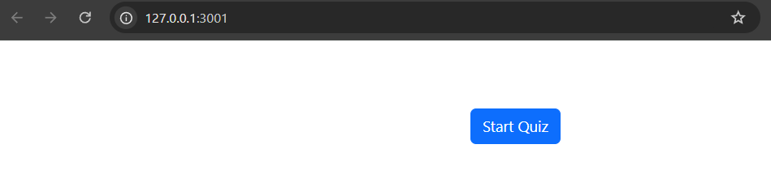
- Click the number next to the wanted answer for each question.  
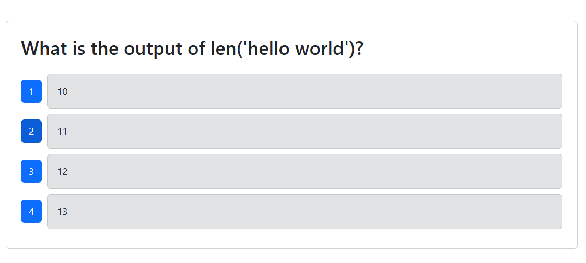
- View your results and click 'Take New Quiz' to generate a new round of questions.  
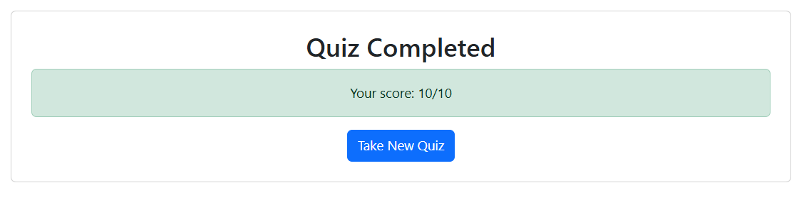

## Testing:
There is a suite of Cypress tests for this application, including both end-to-end tests and component tests. To run them, execute the following steps:
- In a terminal start the application:
```
$ npm run start:dev 
```

- In another terminal start cypress:
```
$ npm run cypress 
```

### Component Tests
- In Cypress, click Component Testing.  
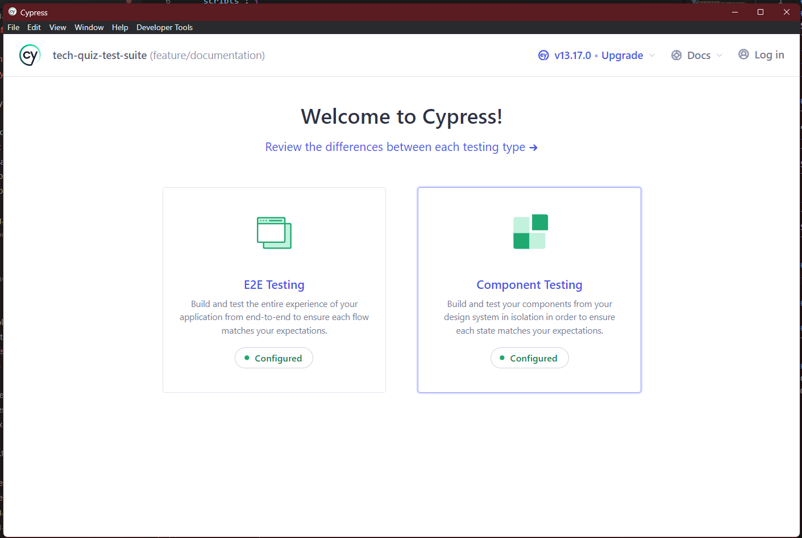
- Select electron, and click 'Start Componenet Testing in Electron'.  
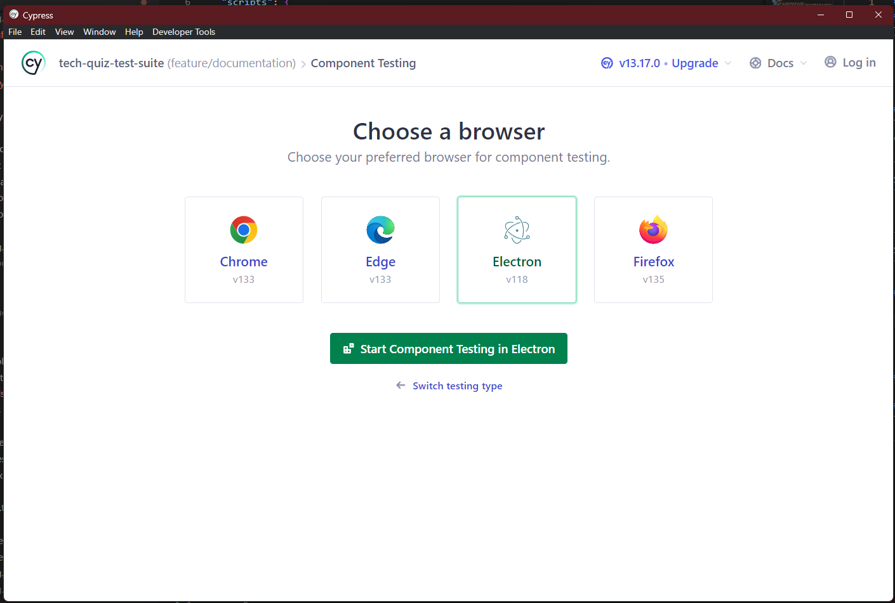
- Click the 'Quiz.cy.tsx' component spec.  
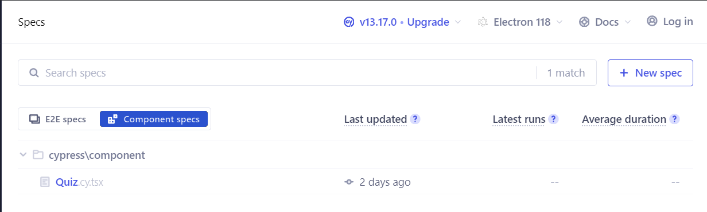
- Allow the tests to run and pass.  
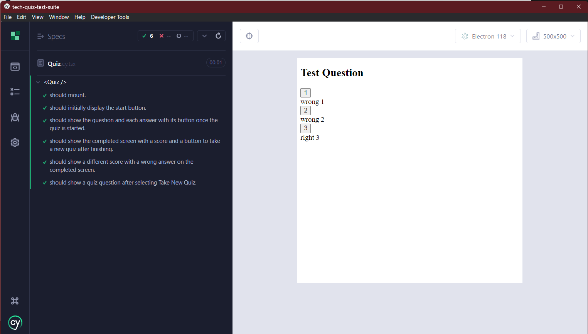

### End-to-end Tests
- In Cypress, click E2E Testing.  
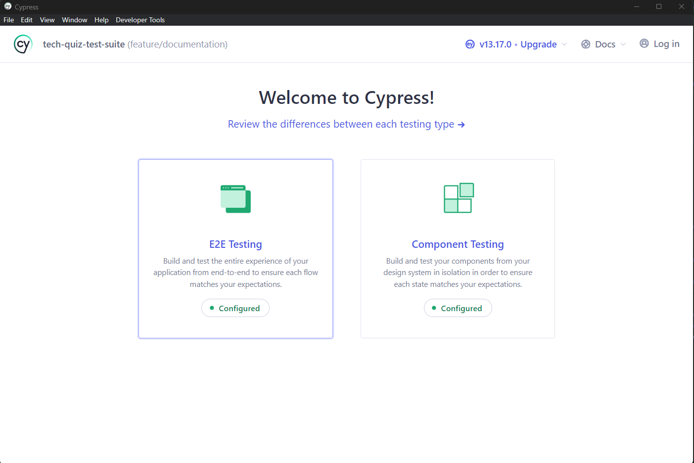
- Select electron, and click 'Start E2e Testing in Electron'.  
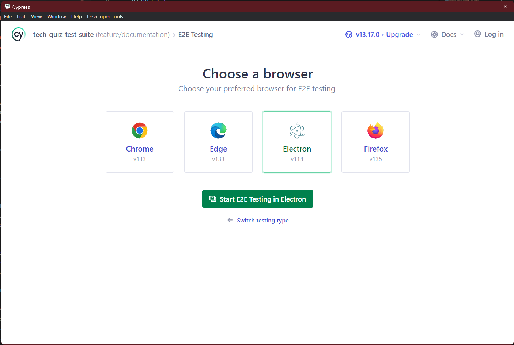
- Click 'quiz.cy.ts' e2e spec.  
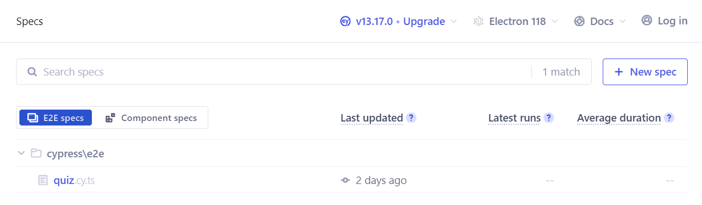
- Allow the tests to run and pass.  
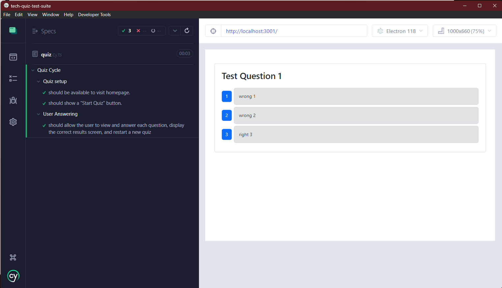

## License:
This application is covered under the [ISC](https://opensource.org/licenses/ISC) license.

## Questions:
Contact me via github: [kayla-e774](https://github.com/kayla-e774)  
Or email me at: <kengelstad16@gmail.com>